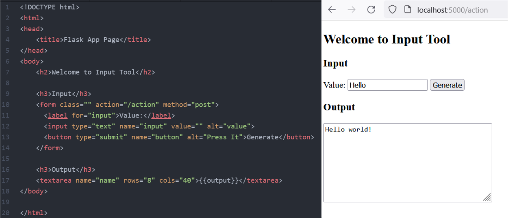

#  Flask Input App
Flask App which runs Python user-defined function for html-form input field and return result back to html text area as an output.

For me it's an extremely common case to test and embed Python functionality into
web app. That's why this repo exists.

# How it works

1. Flask serves webpage welcome.html
2. User writes text into text input.
3. User clicks "Generate" button
4. Python user-defined function `special_f` executes on the input.
5. User gets the result of `special_f` in textarea in Output section.

Function *special_f* adds **' world!'** to input string:
```python
def special_f(text: str):    
    return "{0} {1}".format(text, "world!")
```

Full flask code:

```python
from flask import Flask, request, render_template
app = Flask(__name__)

@app.route("/<name>", methods=['GET', 'POST'])
def welcome(name):
    input = request.form.get("input")
    output = special_f(input)
    return render_template("welcome.html", output=output)

def special_f(text: str):
    return "{0} {1}".format(text, "world!")

if __name__ == '__main__':
    app.run(debug=True)
```

# Preview



# Run
Linux:
```bash
export FLASK_APP=app.py
flask run
```
Windows:
```bash
set FLASK_APP=app.py
flask run
```

Check http://localhost:5000/action url.

# Cheatsheet

One-page cheatsheet [doc](doc/cheatsheet.pdf).
